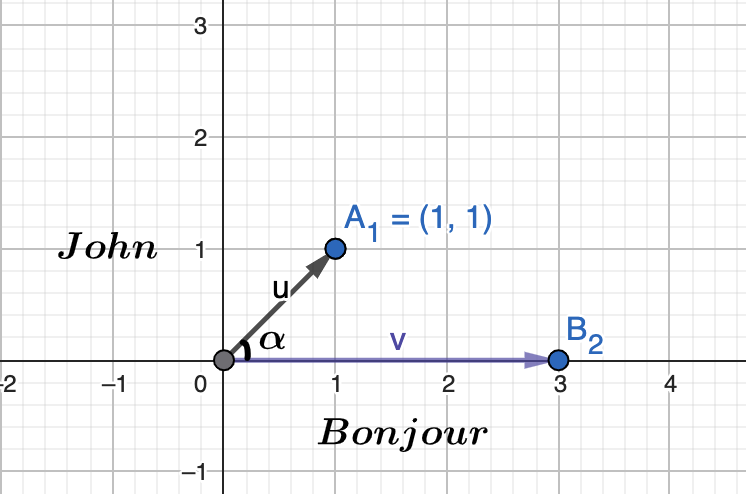
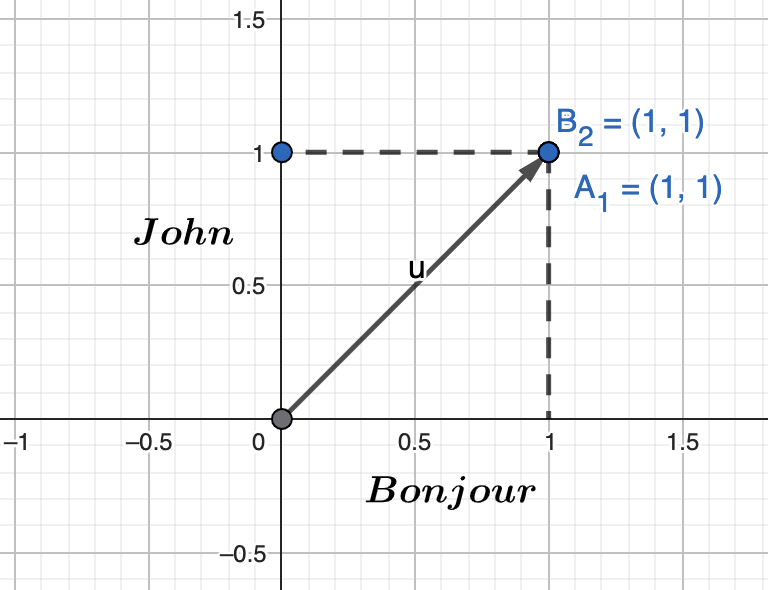
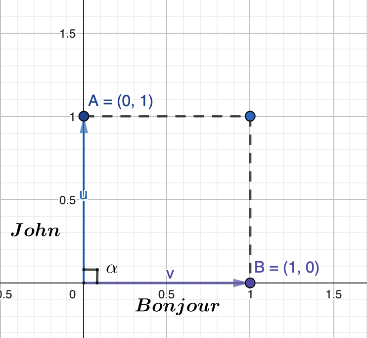

# Cosine similarity

## Definition

Similarity by cosine determines the degree of similarity between two sentences by calculating the cosine of the angle formed by the two vectors in each sentence.

Consider the following sentences:

- Bonjour John.
- Bonjour Doé.

Note that the two sentences are similar, but how can you tell with a computer?

## Simple 2-dimensional space example

Consider the following sentences:

- Bonjour John.
- Bonjour.

Note that one of the two sentences is made up of two words, so they can be represented in a two-dimensional space.

The following similarity table is created:

The representation in a reference frame gives:

Sentence 1 is represented by the vector $A_{1}(1, 1)$ and sentence 2 by the vector $B_{2}(1, 0)$.

The angle formed by these two vectors is the $\alpha$ angle, whose cosine is used to calculate the similarity between the two sentences.

In the previous example, $\alpha=45^{o}$ of which $cos(\alpha)=0.71$. So $71\%$ chance that the two sentences are similar.

Suppose sentence 2 is $\textbf{Bonjour, Bonjour, Bonjour.}$ then we get:

The representation in a reference frame gives:

**Regardless of the length of sentence 2, the number of times $\textit{Bonjour}$ is added does not change the cosine of $\alpha$.**

**Summary:** Cosine similarity is the cosine of the angle between two vectors, revealing the similarity between them. Its value is always between 0 and 1.

## Case of exact similarity

Consider the following two sentences:

- Bonjour John.
- Bonjour John.

It's like a table of similarities:

The representation in a reference frame gives:

The two vectors coincide, so $\alpha = 0^{o}$ or $cos(\alpha)=1$, i.e. 100\% chance that the two vectors are similar. We can conclude that the two sentences are totally similar.

## No similarity

Consider the following two sentences:

- Bonjour.
- John.

The similarity table gives:

The representation in a reference frame gives:

The angle formed by the two vectors is $\alpha = 90^{o}$ so $cos(\alpha) = 0$ or a 0\% chance that the two vectors are similar. We can conclude that the two sentences are completely different.

## Summary

- $cos(\alpha) = 0$: If there is no similarity between the two sentences.
- $cos(\alpha) = 1$: Exact similarity.
- $cos(\alpha) \in ]0, 1[$: Sensibly similar when both sentences have words in common.

To get the **cosinus** of the similarity between two sentences, follow these steps:

1. Make a word frequency chart (count the number of occurrences of each word in each sentence).
2. Show points.
3. Find the angle between Vectors.
4. Calculate the cosine of the formed angle.

## Complex cases

The previous cases work for sentences with two words, i.e. representable in a 2-dimensional space $R \text{x} R$.

Real-life sentences are either multi-word or representable in a $R^{n}$ space, in which case we use the following formula:

$cos(\alpha) = \frac{\sum_{i=1}^{n}A_{i}B{i}}{\sqrt{\sum_{i=1}^{n}A_{i}^{2}} * \sqrt{\sum_{i=1}^{n}B_{i}^{2}}}, with \ i = \  \text{word index}$

Consider the following sentences:

- Bonjour John
- Bonjour

Calculating the similarity gives:

$cos(\alpha) = \frac{(1*1) + (1*0)}{\sqrt{1^{2} + 1^{2}} * \sqrt{1^{2} + 0^{2}}} = \frac{1}{\sqrt{2} * 1} = 0.7071$

The $cos(45)$ found previously.

Let's consider two sentences:

- Bonjour tout le monde.
- Bonjour John

The similarity table gives:

Calculating the similarity gives:

$cos(\alpha) = \frac{(1*1) + (1*0) + (1*0) + (1*0) + (0*1)}{\sqrt{1^{2} + 1^{2} +  1^{2} +  1^{2} + 0^{2}} * \sqrt{1^{2} + 0^{2} + 0^{2} + 0^{2} + 1^{2}}} = \frac{1}{2 * \sqrt{2}} = 0.35$

A 35% chance of being similar.

## Go further

The problem with this method is that similarity is based on word construction (syntactic/grammatical level), so two words **Hi** and **Hello** will be considered dissimilar because the implicit meaning is not taken into account.

Similarly, **better** and **good** will be considered as not similar.

In projects, we use the word lemma, i.e. the basic form of the word, to calculate similarity.

Using the lemma, we get:

- better => lemma good
- good => lemma good

Using the lemmas **better** and **good** will be represented by their lemmatized form and therefore similar.

Furthermore, this method does not take into account the semantic meaning between two sentences, i.e. two sentences **The cat eats the mouse** and **The mouse eats the cat** will be considered syntactically and grammatically similar, but semantically (meaning-wise) they are totally different.

To take the subject further, you can use NLP (Natural Language Processing) libraries such as [SpaCy](https://spacy.io/) and [NLTK](https://www.nltk.org/), which contain automatic language processing tools.

Code examples can be found here: [Calculating similarity in different ways](https://github.com/tisma95/articles/tree/master/cosine-similarity/sentence-similarities-benchmark) which shows various calculation methods natively with Python, SpaCy, NLTK.
