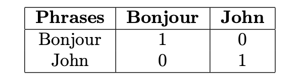

# Similitude par cosinus

## Définition

La similitude par cosinus permet de déterminer le degré de similitude entre deux phrases par calcul du cosinus de l'angle formé par les deux vecteurs de chacune de ces phrases.

Soit les phrases suivantes:

- Bonjour John.
- Bonjour Doé.

On remarque que les deux phrases sont similaires mais comment le savoir avec un ordinateur.

## Exemple Simple espace à 2 dimensions

Soit les phrases:

- Bonjour John.
- Bonjour.

On remarque qu'une des deux phrases est constituée de deux mots donc on peut les représenter dans un espace à deux dimensions.

On crée le tableau de similitude suivant:

La représentation dans un repère donne:

La phrase 1 est représentée par le vecteur $A_{1}(1, 1)$ et la phrase 2 par le vecteur $B_{2}(1, 0)$.

L'angle formé par ces deux vecteurs est l'angle $\alpha$ dont le cosinus permet de calculer la similarité entre les deux phrases.

Dans l'exemple précédent, $\alpha=45^{o}$ dont $cos(\alpha)=0.71$. Soit $71\%$ de chance que les deux phrases soient similaires.

Supposons que la phrase 2 soient $\textbf{Bonjour, Bonjour, Bonjour.}$ alors on aura :

La représentation dans un repère donne:

**Peut importe la longueur de la phrase 2 le nombre d'ajout de $\textit{Bonjour}$ ne change pas le cosinus de $\alpha$.**

**Résumé:** La similitude par cosinus (_cosine similarity en anglais_) est le cosinus de l'angle formé entre deux vecteurs et permet de révéler la similitude entre ceux-ci. Sa valeur est toujours entre 0 et 1.

## Cas de similitude exacte

Soient les deux phrases suivantes:

- Bonjour John.
- Bonjour John.

On a comme comme tableau de similitude:

La représentation dans un repère donne:

Les deux vecteurs sont confondus donc $\alpha = 0^{o}$ soit $cos(\alpha)=1$ soit 100\% de chance que les deux vecteurs soient similaires. On peut conclure que les deux phrases sont totalement similaires.

## Cas d'aucune similitude

Soient les deux phrases suivantes:

- Bonjour.
- John.

Le tableau de similitude donne:

La représentation dans un repère donne:

L'angle formé par les deux vecteurs est $\alpha = 90^{o}$ donc $cos(\alpha) = 0$ soit 0\% de chance que les deux vecteurs soient similaires. On peut conclure que les deux phrases sont totalement différentes.

## Résumé

- $cos(\alpha) = 0$: Si aucune similitude entre les deux phrases.
- $cos(\alpha) = 1$: Similitude totalement exacte.
- $cos(\alpha) \in ]0, 1[$: Sensiblement similaires quand les deux phrases ont en commun des mots.

Pour avoir le **cosinus** de la similitude entre deux phrases suivre les étapes suivantes:

1. Faire un tableau de fréquence des mots (compter le nombre d'occurrences de chaque mot dans chacune des phrases)
2. Afficher les points.
3. Trouver l'angle entre Vecteurs.
4. Calculer le cosinus de l'angle formé.

## Cas complexes

Les cas précédents marchent pour des phrases avec deux mots c'est à dire représentables dans un espace à 2 dimensions $R \text{x} R$.

Les phrases de la vie réelle sont de plusieurs mots soit représentables dans un espace $R^{n}$, dans ce cas on utilise la formule suivante:

$cos(\alpha) = \frac{\sum_{i=1}^{n}A_{i}B{i}}{\sqrt{\sum_{i=1}^{n}A_{i}^{2}} * \sqrt{\sum_{i=1}^{n}B_{i}^{2}}}, avec \ i = \  \text{indice des mots}$

Soient les phrases suivantes:

- Bonjour John
- Bonjour

Le calcul de la similitude donne:

$cos(\alpha) = \frac{(1*1) + (1*0)}{\sqrt{1^{2} + 1^{2}} * \sqrt{1^{2} + 0^{2}}} = \frac{1}{\sqrt{2} * 1} = 0.7071$

Soit les $cos(45)$ trouvé précédemment.

Soient deux phrases:

- Bonjour tout le monde.
- Bonjour John

Le tableau de similitude donne:

Le calcul de la similitude donne:

$cos(\alpha) = \frac{(1*1) + (1*0) + (1*0) + (1*0) + (0*1)}{\sqrt{1^{2} + 1^{2} +  1^{2} +  1^{2} + 0^{2}} * \sqrt{1^{2} + 0^{2} + 0^{2} + 0^{2} + 1^{2}}} = \frac{1}{2 * \sqrt{2}} = 0.35$

Soit 35% de chance d'être similaires.

## Aller plus loin

Le soucis avec cette méthode est que la similitude se base sur la construction des mots (plan syntaxique/grammatical) donc deux mots **Bonjour** et **Hello** seront considérés comme non similaires car le sens implicite n'est pas pris en compte.

De même **Beau** et **Belle** seront considérés comme non similaires.

Dans les projets, on utilisera le lemme des mots c'est à dire la forme de base du mot pour le calcul de la similitude.

Avec l'utilisation du lemme on aura:

- beau => lemme beau
- belle => lemme beau

En utilisant les lemmes **Beau** et **Belle** seront représentés par leur forme lemmatisée et donc similaires.

De plus, cette méthode ne prend pas en compte le sens sémantique entre deux phrases c'est à dire deux phrases **Le chat mange la souris** et **La souris mange le chat** seront considérées comme similaires au plan syntaxique et grammatical mais sur le plan sémantique (du sens) elles sont totalement différentes.

Pour aller plus loin sur le sujet, on peut utiliser les librairies de NLP (Natural Language Processing) comme [SpaCy](https://spacy.io/) et [NLTK](https://www.nltk.org/) qui contiennent des outils de traitement automatique des langues.

Vous trouverez des exemples de codes ici: [Calcul de la similitude de différentes manières](https://github.com/tisma95/articles/tree/master/cosine-similarity/sentence-similarities-benchmark) qui montre diverses méthodes de calcul de manière natif avec Python, SpaCy, NLTK.
