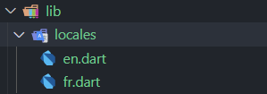

# Internationalisation inside flutter APP without any package

## Introduction

In this article, I'm going to explain how to implement translation in a Flutter application using another method with dart classes.
The goal of this article is to explain how to support multiple languages in a Flutter application.

## Why this method ?

The Flutter documentation includes a tutorial <a href="https://docs.flutter.dev/ui/accessibility-and-localization/internationalization" target="_blank">Internalization With Flutter</a> explaining how to support multiple languages in Flutter. However, this method allows an application to be translated according to the user's language, i.e. the language of the user's phone. But what happens if the user language in the application is different from the phone language?

Suppose an application supports two languages, English and French, and a user decides to associate the French language with his profile when using the application. How do you display the application in French if he's using a phone whose language is English?

I have written this article to help you realize the following points:

- To show how to display an application's language independently of the user's phone language.

- How to use dart classes to manage translation instead of **.json** or **.arb** files.

- How to integrate translation into the Flutter application without a package.

## Final result

The application which will be created for the demo is simple application which will display the message according to a specific language string. The demo is below:

The default language is English when the application is open:


When we click on the button to change the language, the language is updated to French as shown below:


## Implementation

- Create a new **Flutter** application, in my case i created the application **flutter_translation_app** my project structure is:


- In folder **lib** create new folder **locales** which we contain the translation string for each language.

- Inside the **locales** folder add new files **en.dart** and **fr.dart** for the language translation strings like following result:



`
For a new language, we need to add a new class to the **lib/locales** folder.
`

- Add to the *lib/locales/fr.dart* file the translation strings for the French language identified by keys with the following content:

```dart
class FrLang {
  final locales = const {
    'appTitle': "Demo internationalisation Flutter",
    "message": "Bonjour tout le monde !",
    'btLabel': "Traduire en Anglais"
  };
}
```

- Define the corresponding translation in the *lib/locales/fr.dart* file for the English language with the following content:

```dart
class EnLang {
  final locales = const {
    'appTitle': "Flutter internationalization Demo",
    'message': "Hello World !",
    'btLabel': "Translate in French"
  };
}
```
`For new string we should define in each locales class the translation value with same key.`

- We're now going to create the main localization manager. In the *lib* folder, we'll create the file **localization.dart** with the following contents:

```dart
import 'package:flutter_translation_app/locales/en.dart';
import 'package:flutter_translation_app/locales/fr.dart';

class AppLocalization {
  AppLocalization({required this.lang});

  String lang = "en";

  static final _localizedValues = <String, Map<String, String>>{
    'en': EnLang().locales,
    'fr': FrLang().locales,
  };

  static List<String> languages() => _localizedValues.keys.toList();

  String translation(key) {
    return _localizedValues[lang]![key] ?? key;
  }
}

```
The code above imports the language classes from the local folder and then loads the local channels for each channel, associating the local key 'en' for English and 'fr' for French.

## Use translation

The method **translation(key)** inside class **AppLocalization** will return the translation string according to **key** and **lang**.

To translate a string in an application screen, this format must be used:
For example, in the application, if we use :

- **AppLocalization(lang: "en").translate('message')** will return "Hello World !"
- **AppLocalization(lang: "fr").translate('message')** will return "Bonjour tout le monde !"

In file *lib/main.dart* we will add the following code to display demo application:

```dart
import 'package:flutter/material.dart';
import 'package:flutter_translation_app/localization.dart';

void main() {
  runApp(const MainApp());
}

class MainApp extends StatefulWidget {
  @override
  const MainApp({Key? key}) : super(key: key);

  @override
  State<MainApp> createState() => _MainAppState();
}

class _MainAppState extends State<MainApp> {
  String lang = "en";

  final TextStyle textStyle =
      const TextStyle(fontSize: 20, fontWeight: FontWeight.bold);

  @override
  Widget build(BuildContext context) {
    return MaterialApp(
      home: Scaffold(
        appBar: AppBar(
          leading: const Icon(Icons.language),
          title: Text(AppLocalization(lang: lang).translation("appTitle")),
        ),
        body: Center(
          child: Column(
            mainAxisAlignment: MainAxisAlignment.center,
            children: [
              Text(AppLocalization(lang: lang).translation("message"),
                  style: textStyle),
              const SizedBox(
                height: 20,
              ),
              ElevatedButton(
                  onPressed: changeLang,
                  child: Text(
                    AppLocalization(lang: lang).translation("btLabel"),
                    style: textStyle,
                  ))
            ],
          ),
        ),
      ),
    );
  }

  void changeLang() {
    if (lang == "fr") {
      setState(() {
        lang = "en";
      });
    } else {
      setState(() {
        lang = "fr";
      });
    }
  }
}
```

The main file contains only code to display the translation strings according to lang store in state.

## How to use it

The above code is only simple example to explain how to integrate multi-language inside Flutter application without any package.

This method can be used and adapted for your usecase.

The code of this example is available here:  <a href="https://github.com/tisma95/articles/tree/master/flutter/simple_localization_flutter_app/flutter_translation_app" target="_blank">Code Github of demo App</a>