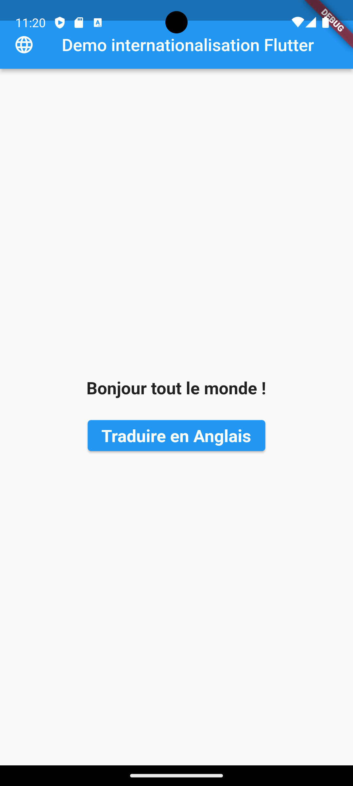

# Plusieurs langues dans une application Flutter sans aucun *package*

## Introduction

Dans cet article, je vais vous expliquer comment mettre en place une traduction dans une application Flutter en utilisant une autre méthode avec des classes dart.
Le but de cet article est d'expliquer comment prendre en compte plusieurs langues dans une application Flutter.

## Pourquoi cette méthode ?

La documentation de Flutter comprend un tutoriel <a href="https://docs.flutter.dev/ui/accessibility-and-localization/internationalization" target="_blank">Internalisation avec Flutter</a> expliquant comment prendre en charge plusieurs langues dans Flutter. Cependant, cette méthode permet à une application d'être traduite en fonction de la langue de l'utilisateur à savoir la langue du téléphone de l'utilisateur. Mais que se passe-t-il si la langue de l'utilisateur dans l'application est différente de la langue du téléphone ?

Supposons qu'une application supporte deux langues, l'anglais et le français, et qu'un utilisateur décide d'associer la langue française à son profil lorsqu'il utilise l'application. Comment afficher l'application en français s'il utilise un téléphone dont la langue est l'anglais ?

J'ai écrit cet article pour vous aider à réaliser les points ci-dessous :

- Montrer comment afficher la langue d'une application indépendamment de la langue du téléphone de l'utilisateur.

- Comment utiliser les classes dart pour gérer la traduction au lieu des fichiers **.json** ou **.arb**.

- Comment intégrer la traduction dans l'application Flutter sans aucun package.

## Résultat final

L'application qui sera créée pour la démonstration est une application simple qui affichera l'application en anglais ou en français en fonction de la langue. La démo est présentée ci-dessous :

La langue par défaut est l'anglais lorsque l'application est ouverte :


Lorsque nous cliquons sur le bouton pour changer de langue, la langue est mise à jour en langue française comme suit :



## Mise en œuvre

- Créer une nouvelle application **Flutter** dans mon cas j'ai créé l'application **flutter_translation_app** la structure de mon projet est :


- Dans le dossier **lib**, créez un nouveau dossier **locales** qui contiendra les chaînes de traduction pour chaque langue.

- Dans le dossier **locales**, ajoutez les nouveaux fichiers **en.dart** et **fr.dart** pour les chaînes de traduction de chaque langue comme suit :


`
Pour une nouvelle langue, nous devons ajouter une nouvelle classe dans le dossier **lib/locales**.
`

- Ajouter dans le fichier *lib/locales/fr.dart* les chaînes de traduction de la langue française identifiées par des clés avec le contenu suivant :

```dart
class FrLang {
  final locales = const {
    'appTitle': "Demo internationalisation Flutter",
    "message": "Bonjour tout le monde !",
    'btLabel': "Traduire en Anglais"
  };
}
```

- Définir la traduction correspondante dans le fichier *lib/locales/en.dart* pour la langue anglaise avec le contenu suivant :

```dart
class EnLang {
  final locales = const {
    'appTitle': "Flutter internationalization Demo",
    'message': "Hello World !",
    'btLabel': "Translate in French"
  };
}
```
`Pour une nouvelle chaîne, nous devons définir dans chaque classe locale la valeur de traduction avec la même clé.`

- Nous allons maintenant créer le gestionnaire de localisation principal. Dans le dossier *lib* nous allons créer le fichier **localization.dart** avec le contenu suivant :

```dart
import 'package:flutter_translation_app/locales/en.dart';
import 'package:flutter_translation_app/locales/fr.dart';

class AppLocalization {
  AppLocalization({required this.lang});

  String lang = "en";

  static final _localizedValues = <String, Map<String, String>>{
    'en': EnLang().locales,
    'fr': FrLang().locales,
  };

  static List<String> languages() => _localizedValues.keys.toList();

  String translation(key) {
    return _localizedValues[lang]![key] ?? key;
  }
}

```
Le code ci-dessus importe les classes de langue du dossier locale et charge ensuite les chaînes locales pour chaque chaîne en associant la clé locale 'en' pour l'anglais et 'fr' pour le français.

## Utiliser la traduction

La méthode **translation(key)** de la classe **AppLocalization** renvoie la chaîne de traduction en fonction de **key** et **lang**.

Pour traduire une chaîne dans une vue de l'application, il faut utiliser ce format :
Par exemple, dans l'application, si nous utilisons :

- **AppLocalization(lang: "en").translate('message')** renverra "Hello World !"
- **AppLocalization(lang: "fr").translate('message')** renverra "Bonjour tout le monde !"

Dans le fichier *lib/main.dart*, nous ajouterons le code suivant pour afficher l'application de démonstration :

```dart
import 'package:flutter/material.dart';
import 'package:flutter_translation_app/localization.dart';

void main() {
  runApp(const MainApp());
}

class MainApp extends StatefulWidget {
  @override
  const MainApp({Key? key}) : super(key: key);

  @override
  State<MainApp> createState() => _MainAppState();
}

class _MainAppState extends State<MainApp> {
  String lang = "en";

  final TextStyle textStyle =
      const TextStyle(fontSize: 20, fontWeight: FontWeight.bold);

  @override
  Widget build(BuildContext context) {
    return MaterialApp(
      home: Scaffold(
        appBar: AppBar(
          leading: const Icon(Icons.language),
          title: Text(AppLocalization(lang: lang).translation("appTitle")),
        ),
        body: Center(
          child: Column(
            mainAxisAlignment: MainAxisAlignment.center,
            children: [
              Text(AppLocalization(lang: lang).translation("message"),
                  style: textStyle),
              const SizedBox(
                height: 20,
              ),
              ElevatedButton(
                  onPressed: changeLang,
                  child: Text(
                    AppLocalization(lang: lang).translation("btLabel"),
                    style: textStyle,
                  ))
            ],
          ),
        ),
      ),
    );
  }

  void changeLang() {
    if (lang == "fr") {
      setState(() {
        lang = "en";
      });
    } else {
      setState(() {
        lang = "fr";
      });
    }
  }
}
```

Le fichier *main* ne contient que du code pour afficher les chaînes de traduction en fonction de la langue stockée dans le *state*.

## Comment l'utiliser

Le code ci-dessus n'est qu'un simple exemple pour expliquer comment intégrer le multi-langue  dans une application Flutter sans aucun *package*.

Cette méthode peut être utilisée et adaptée à votre cas d'utilisation.

Le code de cet exemple est disponible ici : <a href="https://github.com/tisma95/articles/tree/master/flutter/simple_localization_flutter_app/flutter_translation_app" target="_blank">Code Github de l'appli de demo</a>.