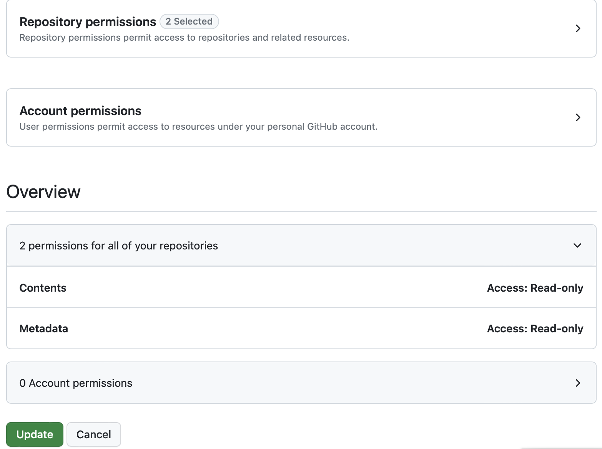
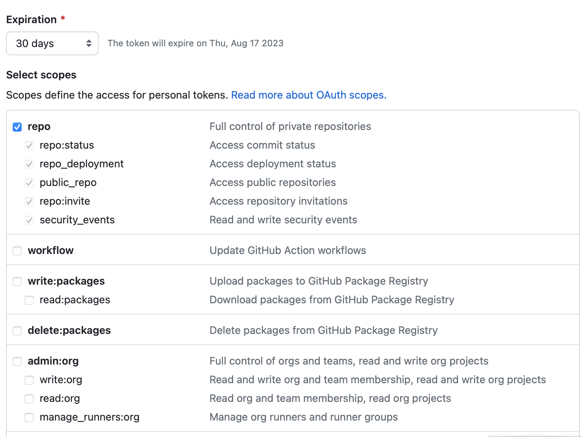
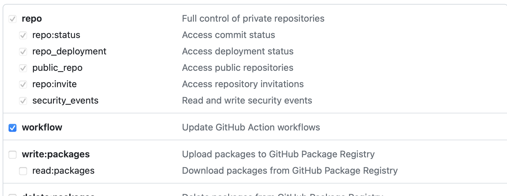
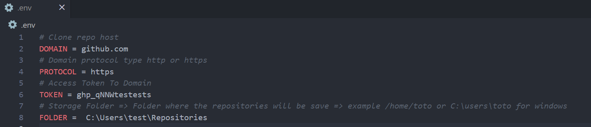
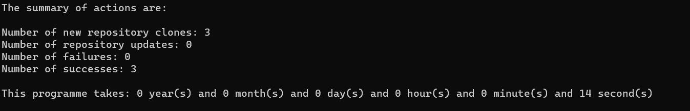

# How do I back up all my Github repositories?

## Goal

The goal of this article is to explain how to back up all your Github repositories with a utility script.

I wrote this script in order to be able to:

+ the personal user repositories private and public,
+ the user organization repositories,
+ the ancestor repositories,
+ the fork repositories.

When the script is run for the first time, it will retrieve all the repositories if the repositories have been previously retrieved it will do an update.

> **Important:**
> The repository name with space will be replace in clone folder by -. Example the repository name like **repo 1** will be clone with name **repo-1**.

---

## Installation

Before getting started, you'll need to install **Python** and **Git** on your machine:

[Python >=3.9](https://www.python.org/downloads/)

[Git](https://git-scm.com/book/en/v2/Getting-Started-Installing-Git)

After installation, you can clone the utility script at the following address: [Github Clone Repo](https://github.com/tisma95/github-clone)

---

## Preparation

### Token creation

Go to your **Github** account to generate a token with read-only authorization as below:

+ If you use the [Fine-grained personal access tokens](https://github.com/settings/tokens?type=beta) you must provide the following authorizations:



+ If you use the [Personal access token (classic)](https://github.com/settings/tokens/new) you must provide the following authorizations:



> **Important:**
> If you want to update fork repositories, you need to give workflow authorization to allow repositories to be updated. Activate the option as shown below:




### Initializing environment variables

In the clone utility project repository folder, create the file **.env** with the following contents:

```yaml
# Clone repo host
DOMAIN = github.com
# Domain protocol type http or https
PROTOCOL = https
# Access Token To Domain
TOKEN = your_generate_token_here
# Storage Folder => Folder where the repositories will be save => example /home/toto or C:\users\toto for windows
FOLDER = folder_path_here
```

You must enter specific values as shown in the example below:



> **Information:**
> During execution, destination folders will be created if they do not exist.

---

## Execution

1. Run the following command in the project folder (must be run once):

    ```cmd
        python -m venv env
    ```
    or
    ```cmd
        python3 -m venv env
    ```
    or for ubuntu
    ```cmd
        virtualenv venv
    ```
    > **Information:**
    > If you encounter an error, please check the following link: https://gist.github.com/frfahim/73c0fad6350332cef7a653bcd762f08d

2. Run the following command to activate the environment:Lancez la commande suivante pour activer l'environnement:

    ```cmd
        source env/bin/activate
    ```
    or on windows
    ```cmd
        env\Scripts\activate.bat
    ```

3. Install the modules from the command:

    ```cmd
        pip install -r requirements.txt
    ```

4. Run the backup script with the command: `python main.py` or `python3 main.py`.

At the end you'll have all the repositories in the destination folder.



> **Information:**
> Note that for each execution you have the log generated inside utility script folder inside subfolder **logs**.