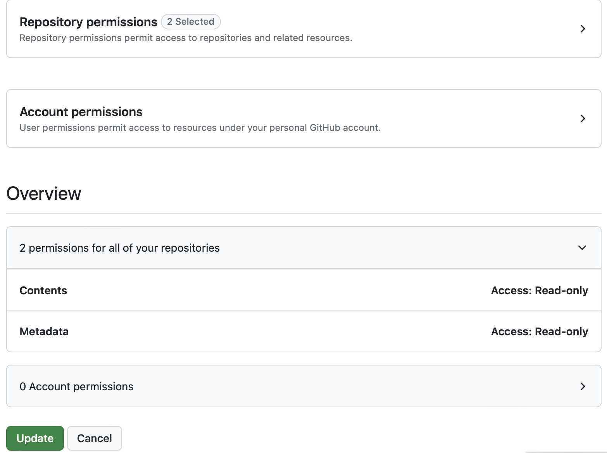
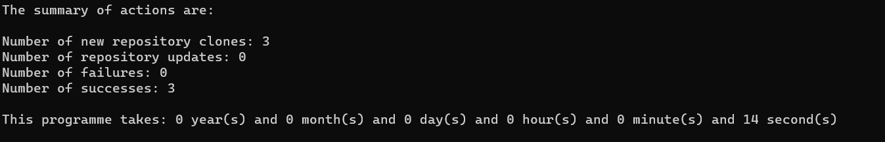

# Comment sauvegarder tous ses dépôts Github ?

## Objectif

L'objectif de cet article est d'expliquer comment sauvegarder l'ensemble de ses dépôts Github avec un script utilitaire.

J'ai écris cet script dans le but de pouvoir :

+ récupérer tous mes dépôts Github ainsi que toutes les branches associées,
+ récupérer tous les dépôts dont j'ai fait un fork ainsi qu'une mise à jour du fork avant récupération,
+ récupérer tous les dépots de mes organisations,
+ récupérer tous les dépôts de mes ascendants.

Quand le script est exécuté pour la première fois, il va récupérer tous les dépôts si les dépôts ont été précédemment récupérer il fera une mise à jour.

> **Important:**
> Les dépôts avec des espaces dans le nom seront récupérés avec remplacement de l'espace par **-**. Par exemple le dépôt avec nom **repo 1** sera récupérer avec le nom **repo-1**.

---

## Installation

Avant de commencer, vous devez installer **Python** et **Git** sur votre machine :

[Python >=3.9](https://www.python.org/downloads/)

[Git](https://git-scm.com/book/en/v2/Getting-Started-Installing-Git)

Après installation, vous pouvez cloner le script utilitaire à l'adresse suivante: [Github Clone Repo](https://github.com/tisma95/github-clone)

---

## Préparation

### Création des tokens

Allez sur votre compte **Github** pour générer un token avec l'autorisation de la lecture uniquement comme ci-dessous :

+ Si vous utilisez l'option [Fine-grained personal access tokens](https://github.com/settings/tokens?type=beta) vous devez fournir les autorisations suivantes :



+ Si vous utilisez l'option [Personal access token (classic)](https://github.com/settings/tokens/new) vous devez fournir les autorisations suivantes :


> **Important:**
> Si vous voulez mettre à jour les dépôts fork, vous devez donner l'autorisation workflow pour permettre la mise à jour des dépôts. Activez l'option comme ci-dessous :


### Initialisation des variables d'environnement

Dans le dossier du dépôt récupéré, créer le fichier **.env** avec le contenu suivant :

```yaml
# Domaine Github
DOMAIN = github.com
# Protocol du domaine par défaut https
PROTOCOL = https
# Copier et coller le token que vous avez généré précédemment ici
TOKEN = le_token_genere_ici
# Dossier là où sera sauvegardé les dépôts mettre le chemin absolu => exemple /home/toto ou C:\users\toto pour windows
FOLDER = chemin_absolu_du_dossier
```

Vous devez mettre les valeurs spécifiques comme l'exemple ci-dessous :


> **Information:**
> Lors de l'exécution, les dossiers de destination seront créés s'ils n'existent pas.

---

## Exécution

1. Lancez la commande suivante dans le dossier du projet (doit être lancé une fois) :

    ```cmd
        python -m venv env
    ```
    ou
    ```cmd
        python3 -m venv env
    ```
    ou pour ubuntu
    ```cmd
        virtualenv venv
    ```
    > **Information:**
    > Si vous rencontrer une erreur, veillez vérifier sur le lien suivant: https://gist.github.com/frfahim/73c0fad6350332cef7a653bcd762f08d

2. Lancez la commande suivante pour activer l'environnement :

    ```cmd
    source env/bin/activate
    ```
    ou sur windows
    ```cmd
        env\Scripts\activate.bat
    ```

3. Installez les modules à partir de la commande :

    ```cmd
        pip install -r requirements.txt
    ```

4. Lancez le script de sauvegarde avec la commande : `python main.py` or `python3 main.py`

Et voilà à la fin vous aurez tous les dépôts dans le dossier de destination.



> **Information:**
> Notez que pour chaque exécution, vous avez le journal généré dans le dossier du script utilitaire dans le sous-dossier **logs**.