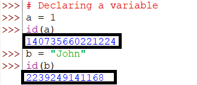
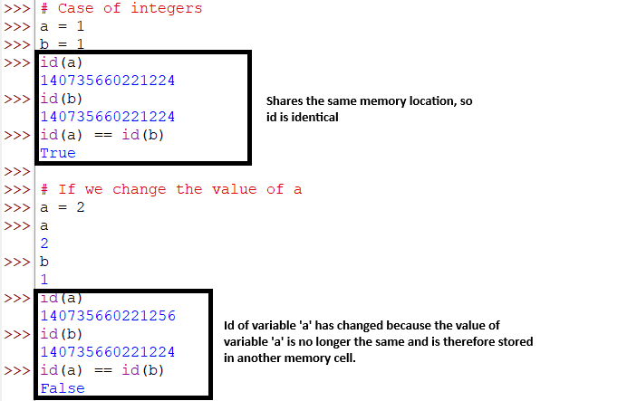
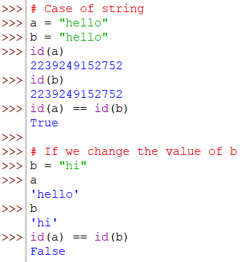
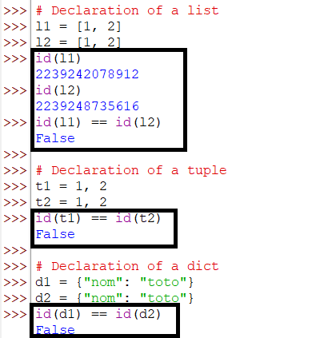
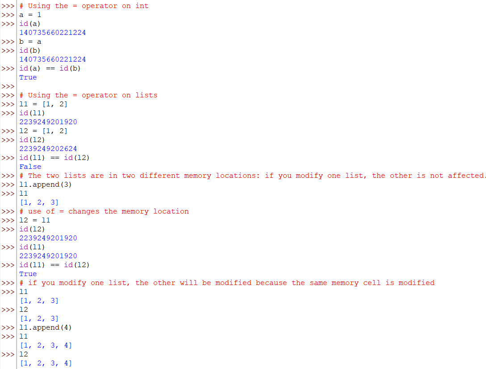
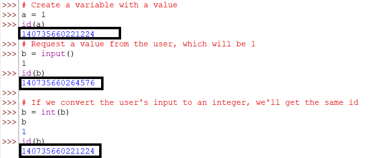
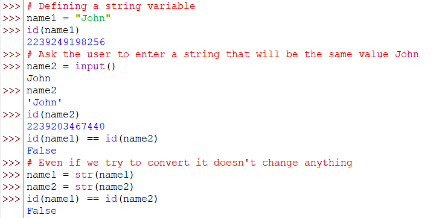
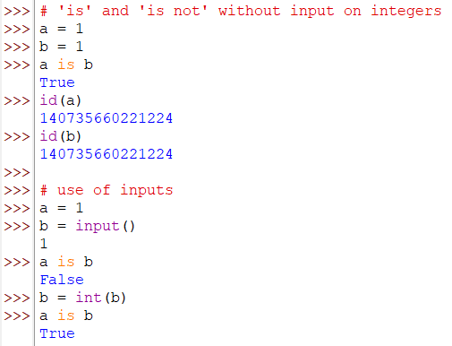
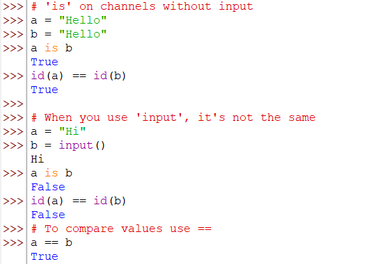

[Image Source](https://logodownload.org/wp-content/uploads/2019/10/python-logo-1.png)

# What is the role of the **id** function in Python?

## Definition

By definition, variables are a pictorial representation of boxes in which Python will store values identified by a label called a variable name.

[Image Source](https://unsplash.com/fr/photos/gros-plan-dun-tiroir-rouge-avec-des-chiffres-dessus-Z43SnJD0rrQ)

If computer memory were represented as a shelf with several numbered drawers, the value of a variable would be stored in one of the drawers.

The role of *id* in Python is to return the number of the memory cell where the value of the variable is stored.

To use **id** we use the following format: `id(variable_name)`. For example:

In the previous example, we can see that the variables *a* and *b* have different memory location numbers, which means that the values of the variables are stored in different memory locations.

**The id function does not always return the same memory cell number. The value obtained varies from one computer to another.**

When writing a program in Python for primitive types such as **int**(integer), **float**(decimal point), **bool**(Boolean) and **str**(string), when two variables have the same value, both variables share the same memory slot as long as the value is identical. As in the examples below:

The same result is obtained with **strings** type **str**.

**This mechanism of sharing the same memory slot does not increase the memory occupied by a variable. 100 variables with the same value and 50 variables with the same value are linked to a single memory cell.**

However, this is no longer the case for **Object** types such as **list**, **tuple** and **dict** (dictionaries). Any declaration of an object-type variable will be stored in a new memory cell, regardless of whether another variable exists or not.

**Unlike primitive types, here we have an increase in the amount of memory occupied. 100 object-type variables will occupy 100 different memory slots.**

When the **=** operation is used to assign one variable to another, the memory location is copied. For example, **a=b** means assigning the same memory location to the **a** and **b** variables, i.e. that of **b**. As the memory location is the same in the case of lists, this amounts to manipulating the same list.

## Ruler with input function

When the user enters the game, things change.

Previously, for primitive types, **id** returned the same value because the variables contained the same values. When the **input** function is used to allow the user to enter a value, the value entered by the user is stored in a new memory cell.

When the user is asked to enter a number, the entry is stored in a new memory cell, as we don't know whether what the user is going to provide is a value already stored or not.

After user input, if we convert and have the same value as one already stored, the identifier becomes that of the currently stored value - this is called **mutation**.

**This mutation mechanism does not work with strings or object types.**

When it comes to the **str** type, the memory location where the user's value is stored will not change even if the same value already exists. This is why **str** strings are said to be **immutable**, as their **id** does not change when already allocated.

## Comparisons rules with *is* and *is not*

In Python, the keywords **is not** and **is**, which are used by some programmers (including me, who fell into the trap, hence the purpose of this article), sometimes incorrectly, to check whether two variables have the same value.

However, this method is not at all the same when it comes to complex types such as **string**.

In reality, the **is** and **is not** keywords compare memory cells, i.e. the result of **id** values, not variable values.

These keywords verify that two variables are stored in the same memory cell. To compare values, we use **==** and **!=** when talking about strings.

***==* and *!=* on primitive types are identical to *is* and *is not*.**.

On the channels, it's not the same.

To summarize:

+ **is** and **is not** give the same result as **!=** and **==** for variables of simple types, since these values are mutable, and memory location identifiers change when the values are identical. Several variables with the same value will have the same memory location.
+ **is** and **is not** are different from **!=** and **==** for complex variables such as strings. Two strings with the same values do not necessarily have the same memory cell identifiers. For strings, we use **==** to check the equality of string variable values and **!=** to check the difference between values.