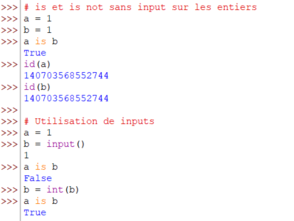

[Source Image](https://logodownload.org/wp-content/uploads/2019/10/python-logo-1.png)

# Quelle est le rôle de la fonction **id** en Python ?

## Définition

Par définition, les variables sont de façon imagée des cases dans lesquelles Python va stocker des valeurs identifiées par une étiquette appelée nom de variable.

[Source Image](https://unsplash.com/fr/photos/gros-plan-dun-tiroir-rouge-avec-des-chiffres-dessus-Z43SnJD0rrQ)

Si la mémoire de l'ordinateur était représentée comme une étagère avec plusieurs tiroirs numéroté, la valeur d'une variable serait stockée dans un de ces tiroirs.

Le rôle de _id_ en Python est de renvoyer le numéro de la case mémoire où est stockée la valeur de la variable.

Pour utiliser **id** on respecte le format suivant: `id(nom_variable)`. Par exemple:

Dans l'exemple précédent on voit que les variables _a_ et _b_ ont un numéro de case mémoire différent ce qui signifie que les valeurs des variables sont stockées dans des cases mémoire différentes.

**La fonction id ne renvoie pas tout le temps le même numéro de case mémoire. La valeur obtenue varie d'un ordinateur à l'autre.**

Quand on écrit un programme en Python pour les types primitifs comme **int**(entier), **float**(nombre à virgule), **bool**(booléen) et les types **str**(chaine) lorsque deux variables ont la même valeur, les deux variables partagent la même case mémoire tant que leur valeur est identique. Comme dans les exemples ci-dessous:

Le même résultat est obtenu avec les **strings** type **str**.

**Ce mécanisme de partage de la même case mémoire n'augmente pas la mémoire occupée par une variable. 100 variables ayant la même valeur et 50 variables ayant la même valeur sont liées à une seule case mémoire.**

Cependant cela n'est plus pareil pour les types **Objets** comme les **list**(liste), **tuple** et les **dict**(dictionnaires). Toute déclaration d'une variable de type objet sera stockée dans une nouvelle case mémoire peu importe qu'une autre variable avec la même valeur existe ou non.

**Contrairement aux types primitifs ici on a une augmentation du nombre de cases mémoire occupées. 100 variables de type objet occuperont 100 cases mémoires différentes.**

Quand on utilise l'opération **=** pour assigner une variable à une autre c'est la copie de la case mémoire qui est faite. **a=b** signifie assigne aux variables **a** et **b** la même case mémoire qui est celle de **b**. Vue que la case mémoire est pareil dans le cas des listes cela revient à manipuler la même liste.

## Subtilité avec input

Quand l'utilisateur entre dans le jeu cela change.

Précédemment pour les types primitifs, **id** renvoyait la même valeur parce les variables contenaient les mêmes valeurs. Quand on utilise la fonction **input** (qui permet à l'utilisateur de saisir une valeur), la valeur saisie par l'utilisateur est stockée dans une nouvelle case mémoire.

Quand l'utilisateur doit saisir un nombre la saisie est stockée dans une nouvelle case mémoire car on ne sait pas si ce que va fournir l'utilisateur est une valeur déjà stockée ou non.

Après la saisie de l'utilisateur, si on convertit et qu'on a la même valeur qu'une déjà stockée, l'identifiant devient celui de la valeur actuellement stockée on parle de **mutation**.

**Ce mécanisme de mutation ne fonctionne pas avec les chaines de caractères ni avec les types objets.**

Quand il s'agit du type **str** la case mémoire où la valeur de l'utilisateur est stockée ne changera pas même si la même valeur existe déjà c'est pourquoi on dit que les chaine de caractères **str** sont **immuables** car leur **id** ne change plus quand déjà alloué.

## Subtilité des comparaisons avec _is_ et _is not_

Il existe en Python les mots clés **is not** et **is** qui sont utilisés par certains programmeurs (moi y compris je suis tombé dans le piège d'où l'objet de l'article) parfois à tort pour vérifier si deux variables ont la même valeur.

Cependant cette méthode ne signifie pas la même chose quand on parle des types complexes comme les **string** (chaines de caractères).

En réalité les mots clés **is** et **is not** font une comparaison des cases mémoire c'est à dire du résultat des valeurs de **id** pas des valeurs des variables.

Ces mots clés vérifient que deux variables sont stockées dans la même case mémoire. Pour comparer les valeurs on utilisera **==** et **!=** quand on parle des chaines.

**_==_ et _!=_ sur les types primitifs sont identiques que _is_ et _is not_.**

Sur les chaines c'est plus pareil.

Pour résumer :

- **is** et **is not** donne le même résultat que **!=** et **==** pour les variables de types simples car ces valeurs sont mutables, les identifiants de cases mémoire changent quand les valeurs sont identiques. Plusieurs variables avec la même valeur auront la même case mémoire.
- **is** et **is not** sont différents de **!=** et **==** pour les variables de types complexes comme les chaines. Deux chaines de mêmes valeurs n'ont pas forcément les mêmes identifiants de cases mémoire. Pour les chaines de caractères on utilisera **==** pour vérifier l'égalité des valeurs des variables de types chaine et **!=** pour vérifier la différence entre les valeurs.
