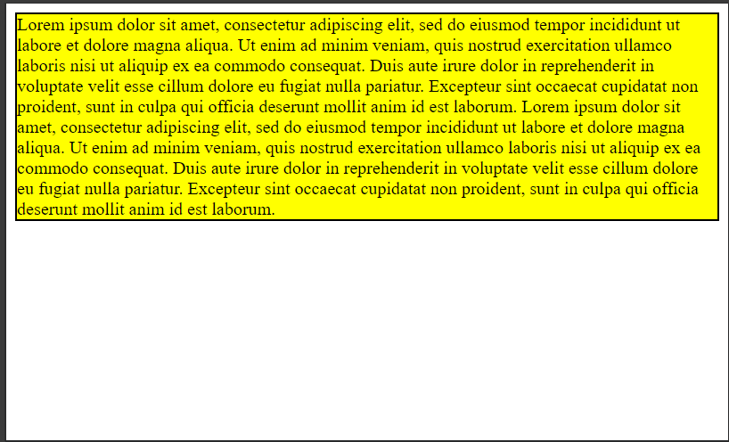

# What's the difference between width/height, min-width/min-height and max-width/max-height with pixel values in CSS?

## Definition of width and height

The **CSS** properties **width** and **height** are used to specify the width and height of an element respectively.

To see the difference between each element, we'll use the following basic code:

```html
<!DOCTYPE html>
<html lang="en">
<head>
    <meta charset="UTF-8">
    <meta name="viewport" content="width=device-width, initial-scale=1.0">
    <title>Height Only</title>
</head>
<body>
    <div class="app">
        Lorem ipsum dolor sit amet, consectetur adipiscing elit, sed do eiusmod tempor incididunt ut labore et dolore magna aliqua.
        Ut enim ad minim veniam, quis nostrud exercitation ullamco laboris nisi ut aliquip ex ea commodo consequat.
        Duis aute irure dolor in reprehenderit in voluptate velit esse cillum dolore eu fugiat nulla pariatur.
        Excepteur sint occaecat cupidatat non proident, sunt in culpa qui officia deserunt mollit anim id est laborum.
        Lorem ipsum dolor sit amet, consectetur adipiscing elit, sed do eiusmod tempor incididunt ut labore et dolore magna aliqua.
        Ut enim ad minim veniam, quis nostrud exercitation ullamco laboris nisi ut aliquip ex ea commodo consequat.
        Duis aute irure dolor in reprehenderit in voluptate velit esse cillum dolore eu fugiat nulla pariatur.
        Excepteur sint occaecat cupidatat non proident, sunt in culpa qui officia deserunt mollit anim id est laborum.
    </div>
</body>
</html>
<style>
    .app {
        /* We'll write the demo code here */
        background-color: yellow;
        border: solid 2px black;
    }
</style>
```

## Property height

### height without constraint

The **height** property is used to apply a height to a *html* element. The value can be absolute in pixel or relative in percentage.

If we apply an absolute value of 20 pixels to our previous *div* by replacing the *style* with:

```css
<style>
    .app {
        height: 20px;
        background-color: yellow;
        border: solid 2px black;
    }
</style>
```

We obtain the following result:


The text inside the *div* overflows the container because the text is larger than 20 pixels.

If you want the content (the text) to be contained within the container (the div), you can use the css property *overflow: auto*. This gives the following style:

```css
<style>
    .app {
        height: 20px;
        overflow: auto;
        background-color: yellow;
        border: solid 2px black;
    }
</style>
```
With the property *overflow: auto;* the container will remain inside the container with a vertical scroll bar.


### height with min

The **height** property can be preceded by **min**. In this case, the operating mode changes:

If **min-height** is used, this means that the element height cannot be smaller than the specified height, even if the screen height is smaller than the specified height.

If we change the style to:

```css
<style>
    .app {
        min-height: 510px;
        overflow: auto;
        background-color: yellow;
        border: solid 2px black;
    }
</style>
```

The height of the web page will be at least equal to the specified height, even if the content of the *div* does not exceed the specified value. For example, on a 648 x 530 (width x height) screen, the result would be.


In the previous example, we can see that the *div* has kept its minimum size of 510 pixels, even though the text inside doesn't exceed 510 pixels.

**If a min-height value is applied to the *div* and the contents of the *div* have a height greater than the specified value, the *div* will have the height of its contents.**

For example, if we apply the following style:

```css
<style>
    .app {
        min-height: 30px;
        background-color: yellow;
        border: solid 2px black;
    }
</style>
```

The result is:


Here the value of the *div* has taken the value of its text content.

To summarize the rules of application:

|       Style       |                   Condition                                           |                  Action                   |
|-------------------|-----------------------------------------------------------------------|-------------------------------------------|
| min-height: 20px; |  If the *div* content can be displayed at a height of 50 pixels, then | the height of the *div* will be 50 pixels |
| min-height: 20px; |  If the *div* content can be displayed at a height of 10 pixels, then | the height of the *div* will be 20 pixels |


### height with max

When the **max-height** property is used, this means that the element can only have a maximum of the specified height.

It works a little differently here:

+ If the element's content is higher than the specified maximum height, an overflow will occur, as shown below:
    ```css
    <style>
        .app {
            max-height: 50px;
            background-color: yellow;
            border: solid 2px black;
        }
    </style>
    ```
    The result is:

    

    **To avoid overflow, you can apply the *overflow: auto;* property to get the result:**

    

+ If the content of the element has a height greater than the maximum height specified, the container takes the height of the content as shown below:
    ```css
    <style>
        .app {
            max-height: 300px;
            background-color: yellow;
            border: solid 2px black;
        }
    </style>
    ```
    The result is:

    

    It doesn't matter what the **max-height** value is, as long as it's greater than the content size, you get the same result.

    ```css
    <style>
        .app {
            max-height: 1000px;
            background-color: yellow;
            border: solid 2px black;
        }
    </style>
    ```
    or

    ```css
    <style>
        .app {
            max-height: 1300px;
            background-color: yellow;
            border: solid 2px black;
        }
    </style>
    ```
    Will give the same result as above:

    

To summarize the application rules:

|       Style       |                   Condition                                                     |                  Action                 |
|-------------------|---------------------------------------------------------------------------------|-----------------------------------------|
| max-height: 20px; |  If the *div* content can be displayed at a height of 50 pixels, then | the height of the *div* will be 20 pixels with a 30-pixel content overflow |
| min-height: 20px; |  If the *div* content can be displayed at a height of 10 pixels, then | the height of the *div* will be 10 pixels identical to that of its content|

For more information on the property, consult [height](https://developer.mozilla.org/en-US/docs/Web/CSS/height).

## Property width

The **width** property is identical to the **height** property, except that the rule applies to the width. This gives the following rules:

|       Style       |                   Condition                                                     |                  Action                  |
|-------------------|---------------------------------------------------------------------------------|------------------------------------------|
| min-width: 20px;  |  If the content of the *div* can be displayed at a width of 50 pixels, then     | the width of the *div* will be 50 pixels |
| min-width: 20px;  |  If the *div* content can be displayed at a width of 10 pixels, then            | the width of the *div* will be 20 pixels |
| max-width: 20px;  |  If the content of the *div* can be displayed at a width of 50 pixels, then | the width of the *div* will be 20 pixels, with the content extending 30 pixels over the width |
| min-width: 20px; |  If the *div* content can be displayed at a width of 10 pixels, then | the width of the *div* will be 10 pixels identical to that of its content|

**As with the **height** property, you can apply the *overflow: auto;* in the case of *width* the content will remain inside the container with a vertical scroll bar.**

**You can also use both properties on the same element.**

For more information on the property, consult [width](https://developer.mozilla.org/en-US/docs/Web/CSS/width).