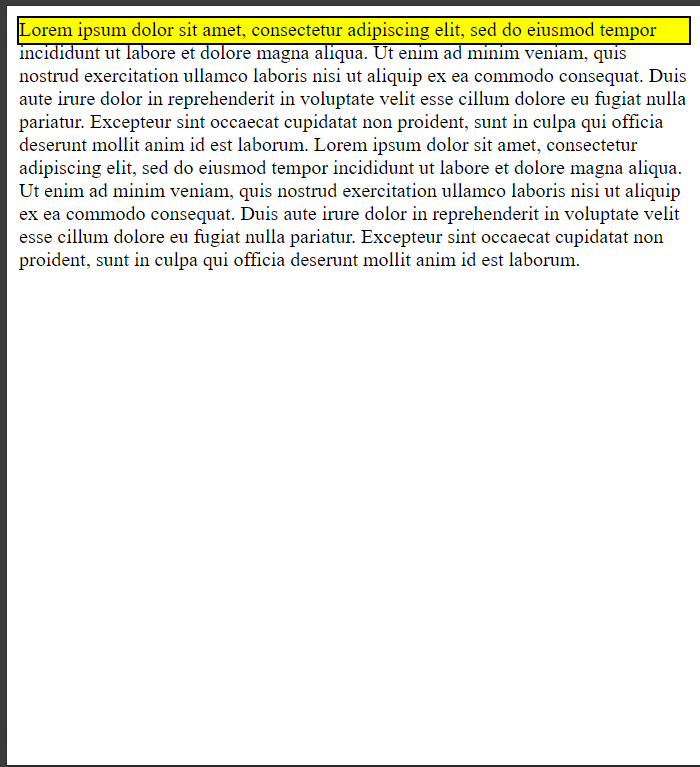
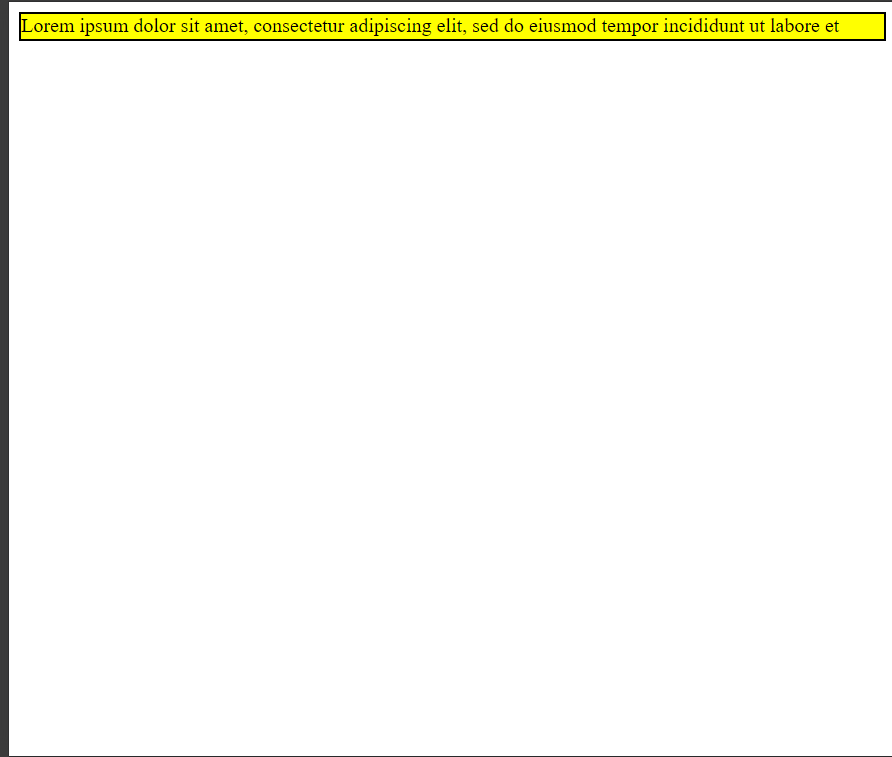
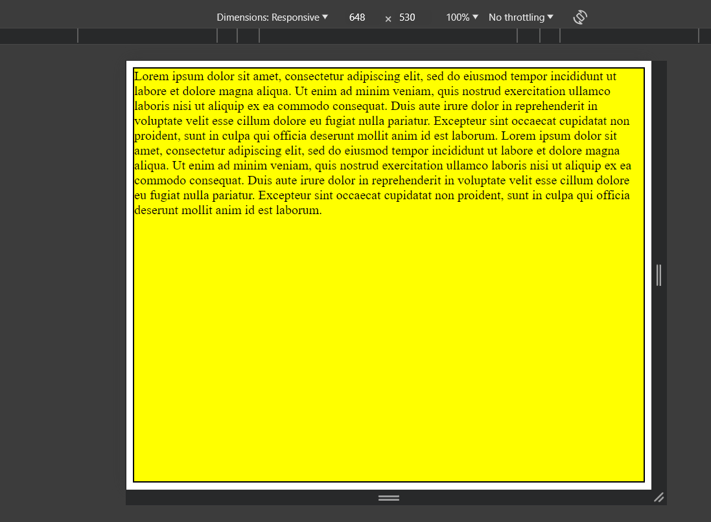
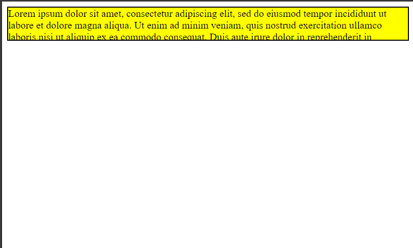

# Quel est la différence entre width/height, min-width/min-height et max-width/max-height avec valeur en pixel en CSS ?

## Définition de width et height

Les propriété **CSS** **width** et **height** permettent respectivement de spécifier la largeur et la hauteur d'un élément.

Pour voir la différence entre chacun des élement nous allons utiliser le code de base suivant:

```html attr.source='.numberLines'
<!DOCTYPE html>
<html lang="en">
<head>
    <meta charset="UTF-8">
    <meta name="viewport" content="width=device-width, initial-scale=1.0">
    <title>Height Only</title>
</head>
<body>
    <div class="app">
        Lorem ipsum dolor sit amet, consectetur adipiscing elit, sed do eiusmod tempor incididunt ut labore et dolore magna aliqua.
        Ut enim ad minim veniam, quis nostrud exercitation ullamco laboris nisi ut aliquip ex ea commodo consequat.
        Duis aute irure dolor in reprehenderit in voluptate velit esse cillum dolore eu fugiat nulla pariatur.
        Excepteur sint occaecat cupidatat non proident, sunt in culpa qui officia deserunt mollit anim id est laborum.
        Lorem ipsum dolor sit amet, consectetur adipiscing elit, sed do eiusmod tempor incididunt ut labore et dolore magna aliqua.
        Ut enim ad minim veniam, quis nostrud exercitation ullamco laboris nisi ut aliquip ex ea commodo consequat.
        Duis aute irure dolor in reprehenderit in voluptate velit esse cillum dolore eu fugiat nulla pariatur.
        Excepteur sint occaecat cupidatat non proident, sunt in culpa qui officia deserunt mollit anim id est laborum.
    </div>
</body>
</html>
<style>
    .app {
        /* On écrira ici le code de la demo */
        background-color: yellow;
        border: solid 2px black;
    }
</style>
```

## Propriété height

### height sans contrainte

La propriété **height** permet d'appliquer une hauteur à un élément *html*. La valeur peut être absolue en pixel ou relative en pourcentage.

Si on appliique une valeur absolue de 20 pixels à notre *div* précédente en remplaçant le *style* par:

```css
<style>
    .app {
        height: 20px;
        background-color: yellow;
        border: solid 2px black;
    }
</style>
```

On obtient le résultat suivant:



Le texte à l'intérieur de la *div* déborde du contenant car le texte est plus grand que 20 pixels.

Si on veut faire contenir le contenu (le texte) dans le conteneur (la div) on peut utiliser la propriété css *overflow: auto*. Ce qui donne comme style:

```css
<style>
    .app {
        height: 20px;
        overflow: auto;
        background-color: yellow;
        border: solid 2px black;
    }
</style>
```
Avec la propriété *overflow: auto;* le contenant restera à l'intérieur du conteneur avec une barre de défilement.



### height avec min

On peut précéder la propriété **height** de **min** ou **max**. Dans ce cas le mode de fonctionnement change:

Si on ajoute utilise **min-height** celà signifie que l'élément ne peut avoir une taille plus pétite que celle spécifiée même si la taille de l'écran est plus pétite que la taille spécifiée.

Si on change le style par:

```css
<style>
    .app {
        min-height: 510px;
        overflow: auto;
        background-color: yellow;
        border: solid 2px black;
    }
</style>
```

La taille de la page web sera au minimum égale à la taille spécifiée même si le contenu de la *div* ne dépasse pas la valeur spécifiée. Par exemple sur un écran de 648 x 530 (largeur x hauteur) aura comme résultat.



Dans l'exemple précédent on voit que la *div* a gardé sa taille minimun de 510 pixels même si le texte à l'intérieur ne dépasse pas les 510 pixels.

**Si jamais on applique une valeur min-height à la *div* et que le contenu de la *div* a une hauteur plus grande que la valeur spécifiée, la *div* aura comme hauteur celle de son contenu.**

Par exemple si on applique le style suivant:

```css
<style>
    .app {
        min-height: 30px;
        background-color: yellow;
        border: solid 2px black;
    }
</style>
```

On obtient comme résultat:


Ici la valeur de la *div* a pris la valeur de son contenu le texte.

Pour résumer les règles d'application:

|       Style       |                   Condition                                                     |                  Action                  |
|-------------------|---------------------------------------------------------------------------------|------------------------------------------|
| min-height: 20px; |  Si le contenu de la *div* peut être affiché sur une hauteur de 50 pixels alors | la hauteur de la *div* sera de 50 pixels |
| min-height: 20px; |  Si le contenu de la *div* peut être affiché sur une hauteur de 10 pixels alors | la hauteur de la *div* sera de 20 pixels |


### height avec max

Quand on utilise la propriété **max-height**, celà signifie que l'élément ne peut avoir qu'au maximun la hauteur spécifiée.

Le fonctionnement ici est un peu différent:

+ Si le contenu de l'élément a une hauteur plus grande que la hauteur maximale spécifiée, on aura un débordement comme ci dessous:
    ```css
    <style>
        .app {
            max-height: 50px;
            background-color: yellow;
            border: solid 2px black;
        }
    </style>
    ```
    Ce qui donne comme résultat:

    

    **Pour éviter le débordement on peut appliquer la proprité **overflow: auto;** pour avoir le résultat:**

    

+ Si le contenu de l'élément a une hauteur plus pétite que la hauteur maximale spécifiée, le conteneur prend la hauteur du contenu comme ci-dessous:
    ```css
    <style>
        .app {
            max-height: 300px;
            background-color: yellow;
            border: solid 2px black;
        }
    </style>
    ```
    Ce qui donne comme résultat:

    

    Peut importe la valeur du **max-height** dès l'instant qu'elle est plus grande que la taille du contenu on obtient le même résultat.
    ```css
    <style>
        .app {
            max-height: 1000px;
            background-color: yellow;
            border: solid 2px black;
        }
    </style>
    ```
    ou

    ```css
    <style>
        .app {
            max-height: 1300px;
            background-color: yellow;
            border: solid 2px black;
        }
    </style>
    ```
    Donnera le même résultat que plus haut:

    

Pour résumer les règles d'application:

|       Style       |                   Condition                                                     |                  Action                 |
|-------------------|---------------------------------------------------------------------------------|-----------------------------------------|
| max-height: 20px; |  Si le contenu de la *div* peut être affiché sur une hauteur de 50 pixels alors | la hauteur de la *div* sera de 20 pixels avec débordement du contenu sur 30 pixels |
| min-height: 20px; |  Si le contenu de la *div* peut être affiché sur une hauteur de 10 pixels alors | la hauteur de la *div* sera de 10 pixels identique à celle de son contenu|

Pour plus d'information sur la propriété consulter [height](https://developer.mozilla.org/fr/docs/Web/CSS/height).

## Propriété width

La propriété **width** est identique à la propriété **height** sauf que la règle s'applique sur la largeur. Ce qui donne les régles suivantes:

|       Style       |                   Condition                                                     |                  Action                  |
|-------------------|---------------------------------------------------------------------------------|------------------------------------------|
| min-width: 20px;  |  Si le contenu de la *div* peut être affiché sur une largeur de 50 pixels alors | la largeur de la *div* sera de 50 pixels |
| min-width: 20px;  |  Si le contenu de la *div* peut être affiché sur une largeur de 10 pixels alors | la largeur de la *div* sera de 20 pixels |
| max-width: 20px;  |  Si le contenu de la *div* peut être affiché sur une largeur de 50 pixels alors | la largeur de la *div* sera de 20 pixels avec débordement du contenu sur 30 pixels sur la largeur |
| min-width: 20px; |  Si le contenu de la *div* peut être affiché sur une largeur de 10 pixels alors | la largeur de la *div* sera de 10 pixels identique à celle de son contenu|

**Comme pour la propriété **height** on peut appliquer la propriété **overflow: auto;** dans le cas du **width** le contenu restera à l'intérieur du conteneur avec une barre de défilement verticale.**

**On peut aussi utiliser les deux propriétés sur un même élément.**

Pour plus d'information sur la propriété consulter [width](https://developer.mozilla.org/fr/docs/Web/CSS/width).